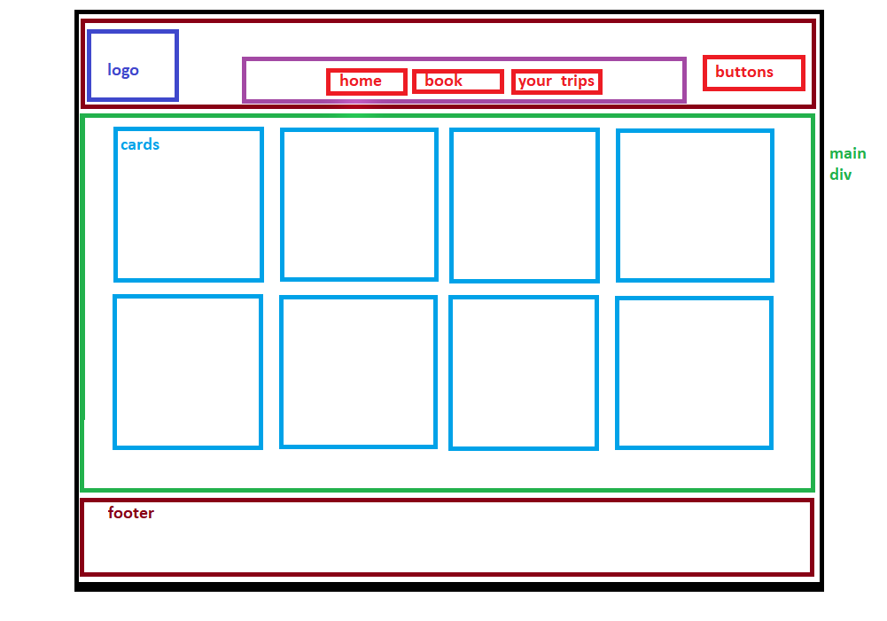
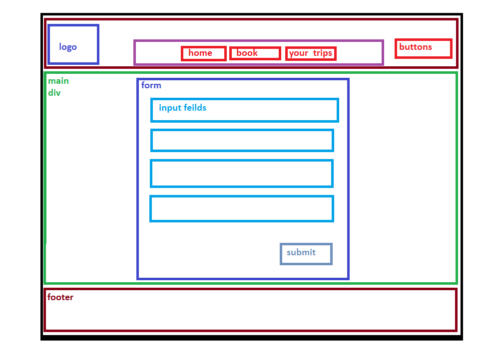
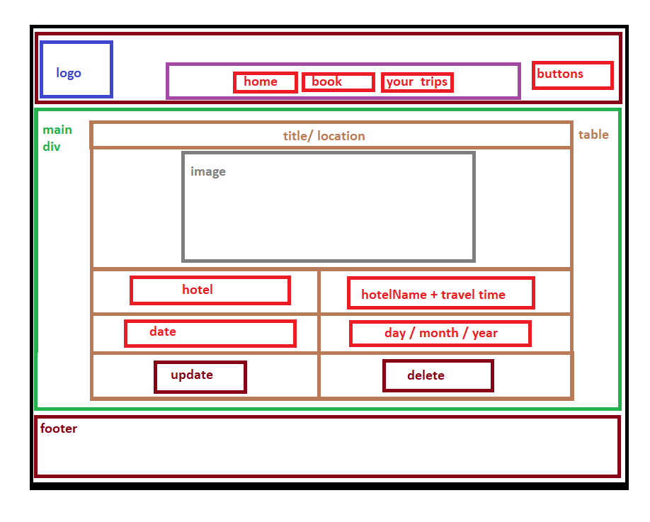

# Project-Prep-4

## What is the vision of this product?

Making tourism in Jordan Easy and available for all.

## What pain point does this project solve?

This project will offer services for traveling and places to go and to book hotels on the app.

And as a collaborator i can add my services to the app.

 

The web app will provide information to the users about all the different places to visit in the area
The web app will provide both walking and driving directions to each of the destinations
Users will be able to "Book" their favorite hotels.
An admin can create and delete user accounts
A user can update their profile information
A user can search all of the products in the inventory
Non-Functional Requirments :

1-Usability : any user can register in our app and show all our services and book the service that the user want.

2- Quality : Our app provide services with high quality.

## Our WireFrame  : 
### Main Page

### 

###
